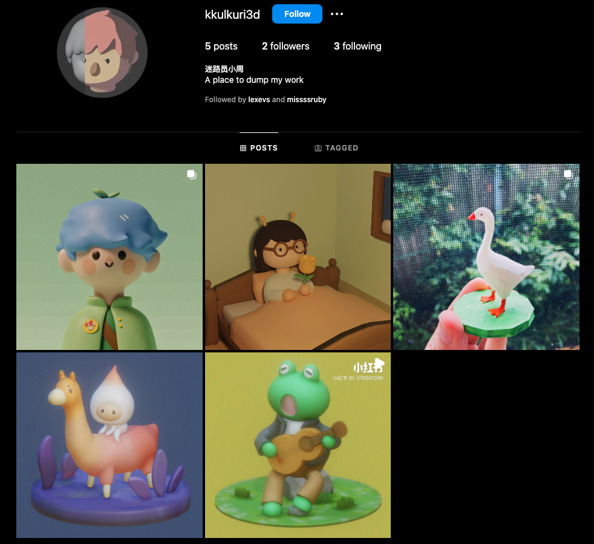

My journey into the world of 3D modeling began out of sheer curiosity and a passion for creative expression. I self-taught myself the intricacies of Blender, a powerful open-source 3D creation suite, and Nomad, an intuitive 3D sculpting tool designed for the iPad. Both platforms allowed me to experiment and bring my ideas to life in a digital three-dimensional space.

Learning these tools was a rewarding experience, enabling me to create a wide range of artwork from initial sketches to polished 3D models. Each project was a stepping stone, allowing me to refine my skills and expand my understanding of 3D design principles.

## Technologies
- Blender
- Nomad

## Link

https://www.instagram.com/kkulkuri3d

I shared my creations on Instagram, where I received valuable feedback and encouragement from the community. You can check out my Instagram to see the collection of my 3D work, which showcases the evolution of my skills and some of my favorite projects.
