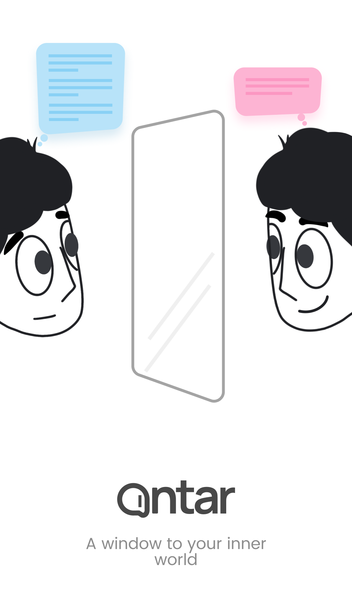

Intrigued by the concept of "Antar: Chat with Inner World," a unique app facilitating self-reflection and internal dialogue, I proactively reached out to the founder in the US to propose the development of a desktop version. Collaborating closely with the team, I contributed my expertise and vision to this innovative project.
Over a three-month period, I single-handedly developed the macOS application from scratch. 

## Technologies
- React
- Electron
- tRPC

## Download link
https://github.com/antarchat/releases/releases/download/v0.0.6-beta/Antar-0.0.6-beta-mac-x64.dmg
