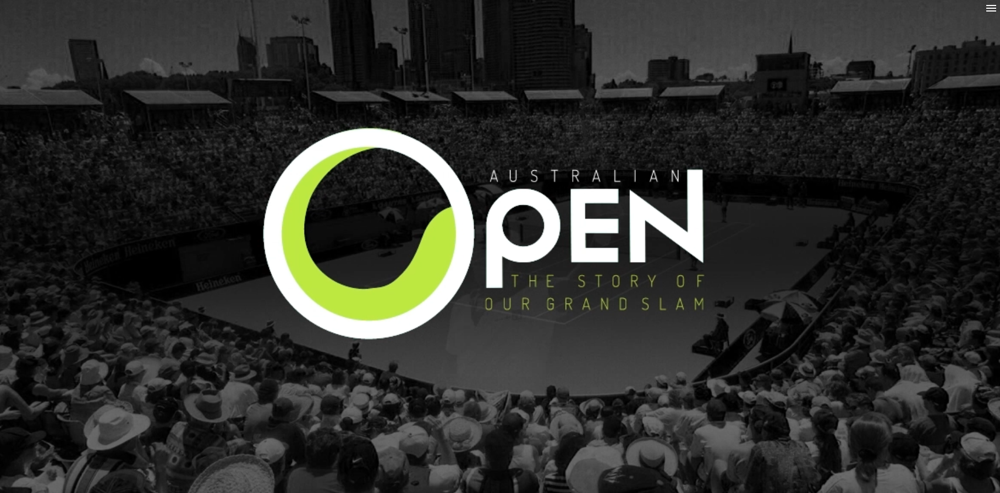

During my time as a Master's student in Multimedia Design, I had the extraordinary opportunity to heavily participate in a collaborative project that documented the story of Australia’s Grand Slam. This project was a unique collaboration between Monash journalism students and Masters of Multimedia Design students, combining our diverse skill sets to create an engaging and informative interactive experience. The project was published on The Australian's online platform.

My primary role involved building the interactive components of the experience. I worked diligently to design and develop a dynamic timeline that encapsulates the rich history of the Australian Open. The project integrated multimedia elements including archival photos, videos, and detailed narratives, providing users with an immersive journey through the evolution of this prestigious tennis tournament.

The project required a robust understanding of web development, user experience design, and multimedia integration. I leveraged a variety of technologies and tools to ensure the final product was seamless, intuitive, and highly engaging. The interactive timeline not only narrates the history but also allows users to explore significant moments and milestones interactively.

This project was a milestone in my academic journey, showcasing my ability to work collaboratively on large-scale projects and my commitment to creating compelling digital experiences. It also emphasized the power of interactive storytelling in enhancing audience engagement and preserving historical narratives.

## Link

https://media.theaustralian.com.au/fe/tennis-interactive-monash/OTF/index.html

Disclaimer: Since it was built in 2016 and out of maintanence, the link might be not functioning. If that happens, you can click on the logo in the menu to reload the page.
