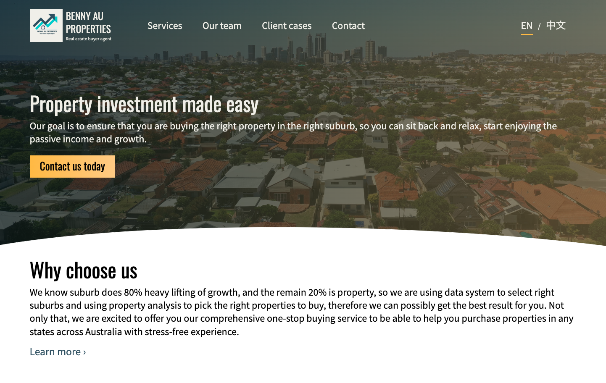

At the request of a buyer agent friend, I designed and developed a marketing website, Benny Au Properties, to help showcase his services and latest property deals. Over the course of two months, I created a platform that is not only visually appealing but also highly functional.

The website is built using React and Gatsby, ensuring a fast and smooth user experience. To provide my friend with the ability to easily update content and manage property listings, I integrated NetlifyCMS. This content management system allows for effortless updates and seamless additions of new properties, making the site continuously relevant and up-to-date.

Additionally, I implemented a cron job to scrape Google reviews from the business. This automated process ensures that the website displays the latest reviews, enhancing the credibility and trustworthiness of the property agent by showcasing positive client feedback in real-time.

## Technologies
- React
- Gatsby
- NetlifyCMS
- Python (for Google reviews scraping)

## Link

https://bennyauproperties.com.au/

This project was a fantastic opportunity to apply my web development skills to a real-world application and deliver a product that directly supports a friend's business goals. The result is a modern, efficient, and user-friendly website that effectively markets his property buying services and builds trust through real-time client reviews.