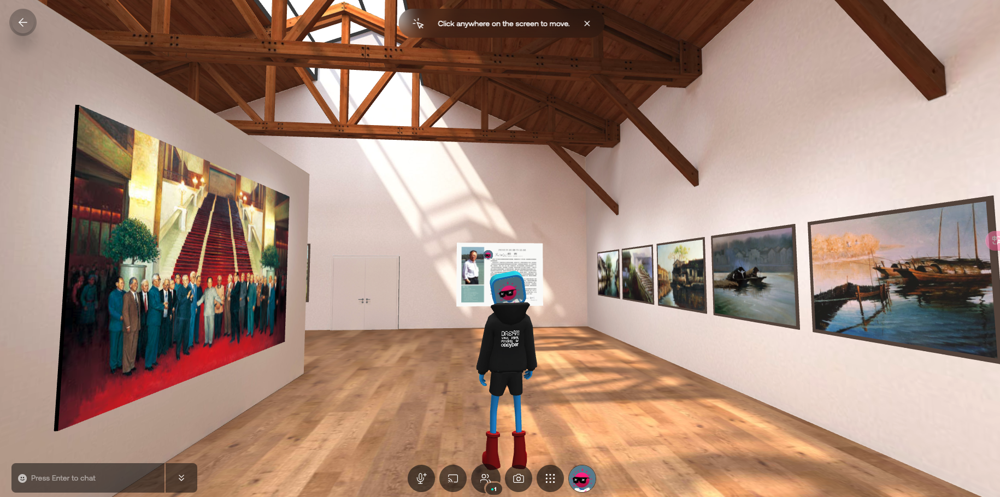

My grandpa is a famous oil painter in China. During the web3 NFT boom phase, I was greatly intrigued by this emerging technology and saw an innovative opportunity to bring his artwork into the digital realm. NFTs, or Non-Fungible Tokens, offer a revolutionary way to authenticate, own, and trade digital assets securely. I believed this would be an excellent medium to preserve and share my grandpa's art with a global audience.

To execute this vision, I digitized his oil paintings and minted them as NFTs on platforms like OpenSea. This process was meticulous and involved high-resolution scanning, creating metadata, and deploying smart contracts. The digitized artwork was then showcased in a Web3 gallery on Oncyber, providing a unique interactive space for art enthusiasts and collectors.

I shared the journey of converting the artwork into NFTs on Chinese social media, specifically on [the Red](https://www.xiaohongshu.com/explore/62c3ff40000000000d02448d). The response was overwhelming, with the post garnering thousands of views and likes. This illustrated the community's growing interest in blending traditional art with contemporary technology and showcased the potential community-building and financial benefits of NFTs.

## Technologies
- Web3
- OpenSea

## Link
https://oncyber.io/spaces/Gsc2qbF6n9L637JnpKLd
