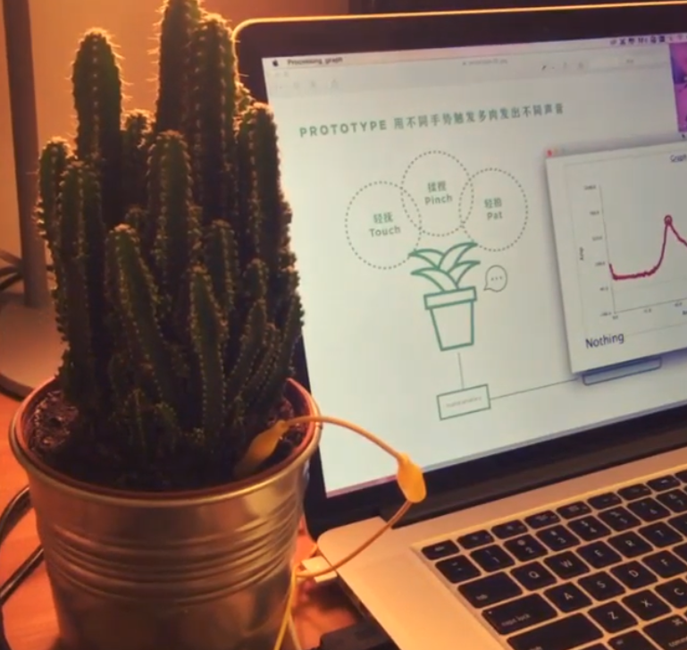

During my internship at OF COURSE in Shanghai, I had the opportunity to work on an exciting project titled "Plants Can Sing." Collaborating closely with a dedicated team of three, we designed and built an innovative interactive device using Arduino technology. The aim was to create a unique and engaging experience for a florist shop, demonstrating how technology can bring a new dimension to product displays.

Our device allowed the succulents to produce sounds when touched, offering an enchanting combination of nature and technology. Integrating various sensors, we ensured that the plants responded intuitively to human touch, producing harmonious sounds that captivated the users. The interactive display was showcased at an international marketing event in the CBD area, where it drew significant attention and positive feedback.

"Plants Can Sing" seamlessly blended tactile interaction with auditory output, transforming a simple product presentation into a captivating sensory experience. This project not only enhanced my technical and design skills but also underscored the potential for interactive design to create memorable and engaging user experiences. Working in a fast-paced, collaborative environment, I honed my abilities in creative problem-solving, teamwork, and user-centric design, contributing to a project that left a lasting impression on both the audience and the floral shop.

## Technologies
- Arduino
