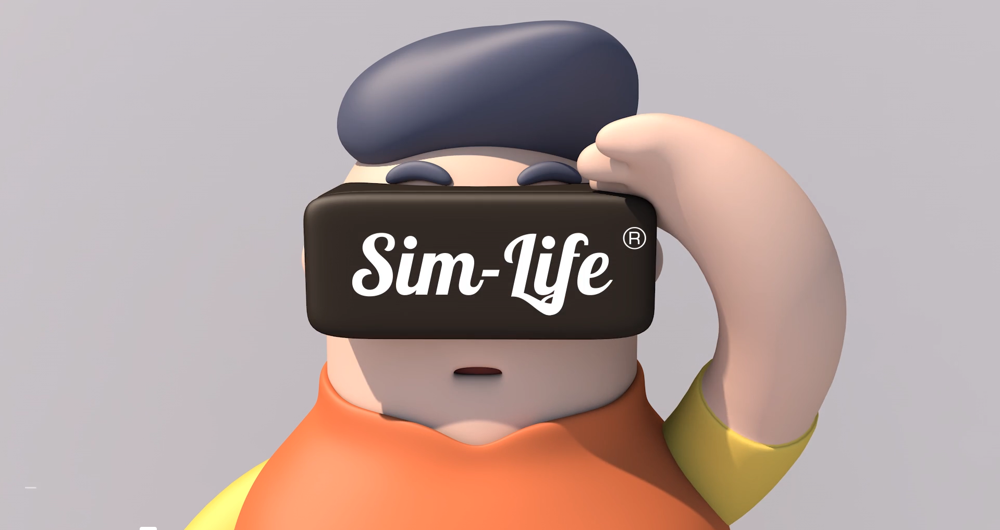

> The year 2016 has been known as the zero era of virtual reality.
> While everyone is enthusiastic about this tech trend, most of us forget to reflect on its potential erosion of our vulnerable senses.
> This animated story happens in the near future when the explosive growth of virtual reality has reached such a peak that almost every experience in the world can be reproduced via this magic box.
> Our hero trades his natural perception for this novel technology.
> Every day, he puts on his headset, eats, plays, and lives in the virtual world. He never believes that this new world could betray him...

Sim Life // the Deception of Perception is an animated short film I created that delves into the philosophical and psychological implications of our increasing reliance on virtual reality. Set in a near-future where VR has become an inseparable part of daily life, the story follows a protagonist who chooses to abandon his natural senses for the allure of a digitally constructed world.

Through advanced 3D modeling in Cinema 4D and intricate post-production in After Effects, I aimed to craft a visually compelling narrative that not only entertains but also provokes thought about the consequences of blurring the lines between reality and virtuality. The animation portrays the seductive nature of VR while also highlighting the risks of losing touch with genuine human experiences and emotions.

Sim Life // the Deception of Perception serves as a cautionary tale, urging viewers to consider the psychological and societal impacts of immersive technologies. As VR continues to evolve, it's crucial to remain grounded in reality, understanding that no matter how perfect a virtual world may seem, it can never replace the authenticity of real human perception.

By combining my passion for storytelling and expertise in multimedia design, this project allowed me to explore new creative horizons and convey a powerful message about the future of technology and its influence on our lives.

## Technologies
- Cinema 4D
- After Effect

## Link
https://vimeo.com/170256069
