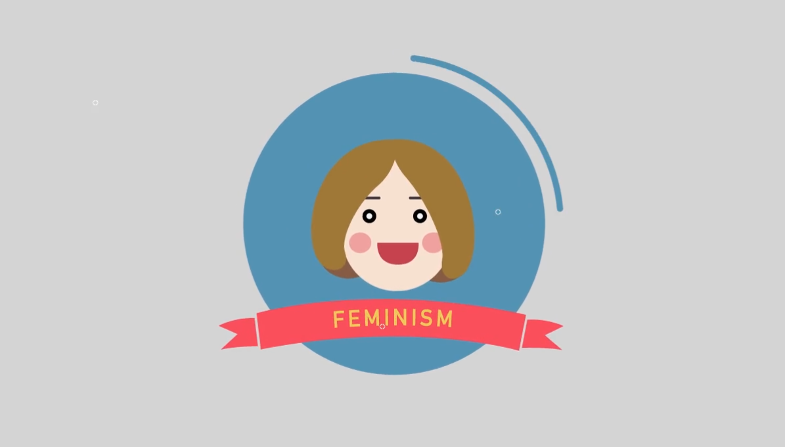
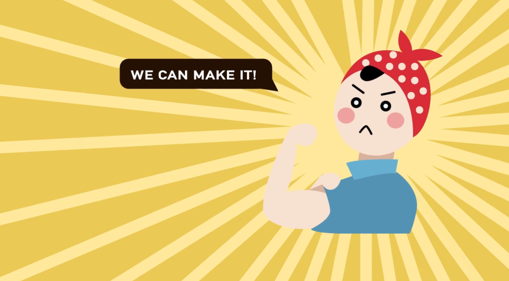

"What is Feminism" is a motion graphic animation I created during my studies in Multimedia Design at Monash University. This project marked my first foray into the world of animation using Adobe After Effects, a skill I picked up and honed within three months.

The project is a comprehensive exploration of the concept of feminism, aiming to educate and inspire viewers through engaging visuals and thoughtful narratives. I was deeply involved in every aspect of the production process, from writing the script to designing the storyboard, crafting the narratives, and building all the visual assets. The animation is a testament to my ability to learn new tools rapidly and apply them effectively to communicate complex ideas.

## Technologies
- Adobe After Effects

## Link

https://vimeo.com/130101701

